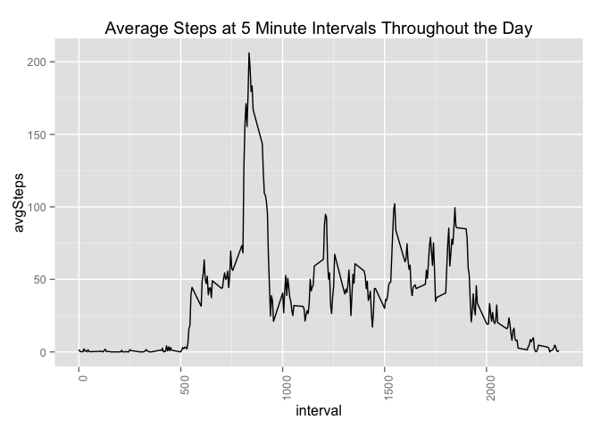

# Reproducible Research: Peer Assessment 1

There is increasingly more interest in the "quantified self" movement.  This project takes a look at a dataset that records the number of steps at different times throughout the day to identify patterns of activity.

## Loading and preprocessing the data
First download the data set from [here](https://d396qusza40orc.cloudfront.net/repdata%2Fdata%2Factivity.zip) and unzip the compressed file.

Once the raw data is ready, read in to R and load libraries that will be used for the analysis


```r
library(dplyr)
library(ggplot2)
setwd("/Users/patm12/documents/git/RepData_PeerAssessment1")
fit=read.csv("activity.csv",stringsAsFactors=F)
```

For the first portion of this analysis we will exclude NA observations in the original data set.


```r
fitDeleteNA=fit[!is.na(fit$steps),]
```
##What is mean total number of steps taken per day?

The data set contains total steps taken in 5 minute intervals over a 2 month period (October and November 2012).  Our first step of analysis is simply to calculate total steps taken each day and graph a histogram of those results.


```r
totalStepsPerDay=fitDeleteNA %>%
  group_by(date) %>%
  summarise(steps=sum(steps))

h <- ggplot(totalStepsPerDay, aes(x=steps))
h + geom_histogram(aes(fill = ..count..)) +
  labs(title = "Total Steps Per Day") + geom_density()
```

 

We can see from the figure above that there is considerable variance but the average daily steps is about 10,000.

We can easily calculate the mean and median steps per day with the following code:


```r
avgSteps=mean(totalStepsPerDay$steps)
avgSteps
```

```
## [1] 10766.19
```

```r
medianSteps=median(totalStepsPerDay$steps)
medianSteps
```

```
## [1] 10765
```
##What is the average daily activity pattern?

We would also like to see how activity varies within the day.  In the underlying data set, the field "interval" refers to a 5 minute interval within the day.  We can calculate the average number of steps across the two month period for each five minute interval and graph those results.


```r
avgStepsPerInterval=fitDeleteNA %>%
  group_by(interval) %>%
  summarise(avgSteps=mean(steps))

l = ggplot(data=avgStepsPerInterval, aes(x=interval, y=avgSteps)) 
l + geom_line() + theme(axis.text.x = element_text(angle = 90, hjust = 1)) +  
  labs(title = "Average Steps at 5 Minute Intervals Throughout the Day")
```

 

We can see a logical pattern here.  On average most people are most active in the morning, presumably on the way to work.  There is another spike around lunch time and then another spike around 5 pm as work finishes. Finally the last spike of activity is typically around 10 pm at night as people return home from dinner or after work activities.

We can see the most active interval of the day with the code below. These results suggest that the most active 5 minute interval of the day is 8:35 in the morning.


```r
maxInterval=as.character(avgStepsPerInterval[avgStepsPerInterval$avgSteps==max(avgStepsPerInterval$avgSteps),"interval"])
maxInterval
```

```
## [1] "835"
```
##Imputing missing values

Quality of data is an issue with many of the new "quantified self" data sets and this set is no exception.  Upon inspection we can see that there are many missing observations in the data set.


```r
missingObs=length(fit$steps[is.na(fit$steps)])
missingObs
```

```
## [1] 2304
```

```r
pctMissing=missingObs/length(fit$steps)
pctMissing
```

```
## [1] 0.1311475
```

There are 2304 observations are missing, comprising about 13% of the dataset.  A simple way to compensate for these holes in the data is to substitute the average steps per interval over the entire time period for any interval where the data is missing.


```r
#create a new data set that replaces NA with average for that interval
fit2=merge(fit,avgStepsPerInterval[,c("interval","avgSteps")],all.x=T)
fit2$steps=ifelse(is.na(fit2$steps),fit2$avgSteps,fit2$steps)
```

We can then repeat the above exercise to see a histogram of total steps per day using this "corrected" data set.

When we compare the histogram of the adjusted data set to the previous data set (where NAs were omitted) we find that the adjusted data set has a higher concentration at the center of the distribution.  For example the max count in the unadjusted set was 8 but the max count in the adjusted set was 12.


```r
totalStepsPerDay2=fit2 %>%
  group_by(date) %>%
  summarise(steps=sum(steps))

h2 <- ggplot(totalStepsPerDay2, aes(x=steps),binwidth = 20)
h2 + geom_histogram(aes(fill = ..count..)) +
  labs(title = "Total Steps Per Day \n (Adjusting for NA Values)") + geom_density()
```

 

The new average and median for the "corrected" data set are calculated below


```r
avgStepsPerDay=mean(totalStepsPerDay2$steps)
avgStepsPerDay
```

```
## [1] 10766.19
```

```r
medianStepsPerDay=median(totalStepsPerDay2$steps)
medianStepsPerDay
```

```
## [1] 10766.19
```
##Are there differences in activity patterns between weekdays and weekends?

One of the things we can also observe from this data set is the way that activity throughout the day varies considerably between weekdays and weekend.  In the code below we first create a flag to determine if a particular data is a weekday or weekend.  We then compare average intraday steps per 5 minute interval on week days versus weekends.


```r
fit2$dayOfWeek=weekdays(as.Date(fit2$date))
fit2$dayOfWeek=ifelse(fit2$dayOfWeek=="Saturday" | fit2$dayOfWeek=="Sunday","weekend","weekday")

avgStepsPerInterval2=fit2 %>%
  group_by(interval,dayOfWeek) %>%
  summarise(avgSteps=mean(steps))

l=ggplot(data=avgStepsPerInterval2, aes(x=interval, y=avgSteps)) 
l + facet_wrap(~dayOfWeek) + geom_line() + 
  labs(title = "Average Steps Throughout the Day: \n Weekdays vs Weekends")
```

 

Different patterns can be seen between intradaay activity on weekdays versus weekends.  Whereas on weekdays activity is concentrated around the beginning of the work day, in the case of weekends activity is more evenly distributed throughout the day.  There is a still a peak at the same time as the weekend distribution, but it is less pronounced.  Quite simply, as workers are not required to be at their desks they are naturally more active on weekends versus weekdays.
